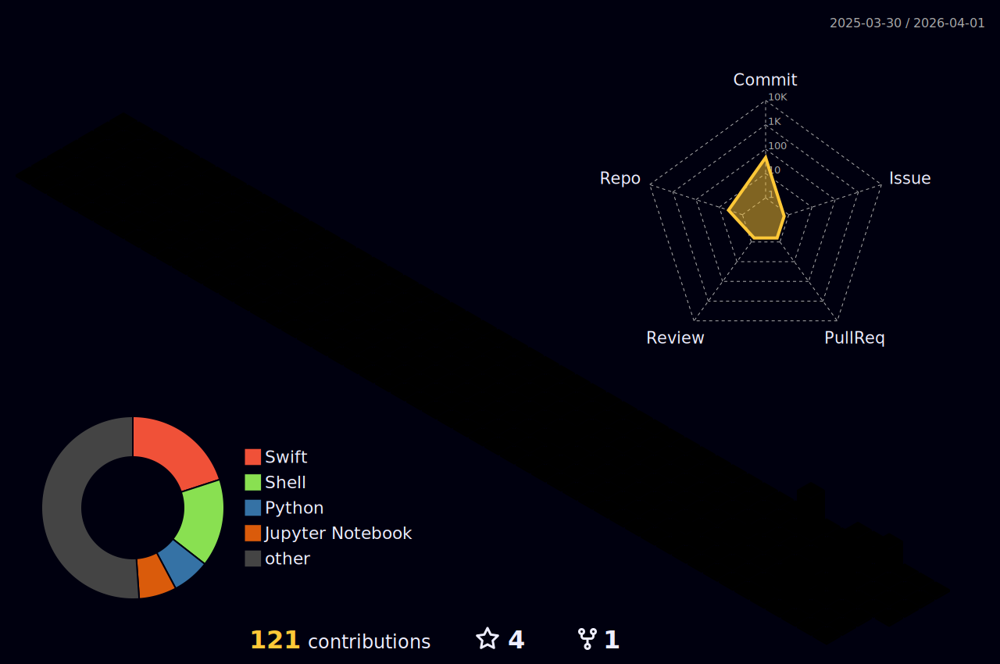

<div align="center">

<!-- Animated Typing Header -->
<a href="https://git.io/typing-svg">
  
</a>
<br/>


<!-- Profile Views Counter -->


<!-- Cool Animated Banner -->


</div>

---

## 🚀 About Me

```python
class ManikSinghSarmaal:
    def __init__(self):
        self.name = "Manik Singh Sarmaal"
        self.role = "AI/ML Developer & Software Engineer"
        self.location = "🌍 Earth"
        self.languages = ["Python", "C++"]
        self.interests = ["Machine Learning", "Computer Vision", "Deep Learning", "IoT"]
        self.currently_learning = "Always something new! 🚀"
    
    def say_hi(self):
        print("Thanks for visiting my profile! Let's build something amazing together! 🚀")

me = ManikSinghSarmaal()
me.say_hi()
```

- 🔭 I'm currently working on **AI/ML Projects & Computer Vision Applications**
- 🌱 I'm currently learning **Advanced Deep Learning & MLOps**
- 👯 I'm looking to collaborate on **Open Source AI/ML Projects**
- 💬 Ask me about **Python, Machine Learning, Computer Vision, Flask**
- ⚡ Fun fact: **I love turning coffee into code! ☕➡️💻**

---

## 🌐 Connect With Me

<div align="center">

[](https://www.linkedin.com/in/manik-singh-sarmaal-66b291261/)
[](https://www.instagram.com/maniksarmaal/)
[](https://www.youtube.com/@maniksarmaal)
[](https://github.com/ManikSinghSarmaal)
[](mailto:maniksarmaal@gmail.com)

</div>

---

## 💻 Tech Stack

<div align="center">

### 🖥️ Languages


### 🤖 AI/ML & Data Science


### 🌐 Web Development


### 🔧 Hardware & IoT


### 🎨 Creative Tools


</div>

---

## 📊 GitHub Analytics

<div align="center">

<!-- 3D Contribution Graph - Generated by GitHub Actions -->
### 🏙️ My 3D Contribution Skyline
<picture>
  <source media="(prefers-color-scheme: dark)" srcset="./profile-3d-contrib/profile-night-rainbow.svg" />
  <source media="(prefers-color-scheme: light)" srcset="./profile-3d-contrib/profile-green-animate.svg" />
  
</picture>

<!-- Note: Run the GitHub Actions workflow to generate this! Go to Actions → GitHub-Profile-3D-Contrib → Run workflow -->

</div>

<div align="center">

### 📈 GitHub Stats

<table>
  <tr>
    <td>
      
    </td>
    <td>
      
    </td>
  </tr>
</table>

### 🔥 Contribution Streak


### 💻 Most Used Languages


</div>

---

## 📊 Weekly Development Breakdown

<!--START_SECTION:waka-->
<!-- If you set up WakaTime, your coding stats will appear here automatically! -->
<!--END_SECTION:waka-->

---

## 🎯 Current Focus

<div align="center">

```
🤖 Machine Learning     ████████████████████░░░░░   80%
👁️ Computer Vision       ██████████████████░░░░░░░   75%
🧠 Deep Learning         ███████████████░░░░░░░░░░   65%
🌐 Web Development       ████████████░░░░░░░░░░░░░   50%
🔧 IoT & Embedded        ██████████░░░░░░░░░░░░░░░   40%
```

</div>

---

## 🐍 Contribution Snake

<div align="center">

<picture>
  <source media="(prefers-color-scheme: dark)" srcset="https://raw.githubusercontent.com/ManikSinghSarmaal/ManikSinghSarmaal/output/github-contribution-grid-snake-dark.svg" />
  <source media="(prefers-color-scheme: light)" srcset="https://raw.githubusercontent.com/ManikSinghSarmaal/ManikSinghSarmaal/output/github-contribution-grid-snake.svg" />
  
</picture>

</div>

---

## 💡 Random Dev Quote

<div align="center">


</div>

---

<!-- Uncomment below if you want to add Spotify - replace YOUR_SPOTIFY_USERNAME with your actual username
<div align="center">

### 🎧 Vibing To

[](https://github.com/kittinan/spotify-github-profile)

</div>
-->

---

<div align="center">

## ⭐ Show Your Support!

If you like my work, consider giving a ⭐ to my repositories!


**"Code is like humor. When you have to explain it, it's bad."** – Cory House

</div>

---

<div align="center">

### 🔝 Top Contributed Repositories

<!-- You can add your top repositories here -->

</div>

<!-- 
╔══════════════════════════════════════════════════════════════════════════════╗
║  🚀 SETUP INSTRUCTIONS FOR 3D CONTRIBUTION GRAPH                             ║
╠══════════════════════════════════════════════════════════════════════════════╣
║  To enable the 3D contribution graph, follow these steps:                    ║
║                                                                              ║
║  1. Create a repository named exactly as your username:                      ║
║     ManikSinghSarmaal/ManikSinghSarmaal                                      ║
║                                                                              ║
║  2. Create this GitHub Actions workflow file:                                ║
║     .github/workflows/profile-3d.yml                                         ║
║                                                                              ║
║  3. Add the following content to the workflow file:                          ║
║                                                                              ║
║  ═══════════════════════════════════════════════════════════════════════     ║
║  name: GitHub-Profile-3D-Contrib                                             ║
║                                                                              ║
║  on:                                                                         ║
║    schedule:                                                                 ║
║      - cron: "0 18 * * *"  # Runs daily at 6 PM UTC                          ║
║    workflow_dispatch:  # Allows manual trigger                               ║
║                                                                              ║
║  permissions:                                                                ║
║    contents: write                                                           ║
║                                                                              ║
║  jobs:                                                                       ║
║    build:                                                                    ║
║      runs-on: ubuntu-latest                                                  ║
║      name: generate-github-profile-3d-contrib                                ║
║      steps:                                                                  ║
║        - uses: actions/checkout@v5                                           ║
║        - uses: yoshi389111/github-profile-3d-contrib@latest                  ║
║          env:                                                                ║
║            GITHUB_TOKEN: ${{ secrets.GITHUB_TOKEN }}                         ║
║            USERNAME: ${{ github.repository_owner }}                          ║
║        - name: Commit & Push                                                 ║
║          run: |                                                              ║
║            git config user.name github-actions                               ║
║            git config user.email github-actions@github.com                   ║
║            git add -A .                                                      ║
║            if git commit -m "generated"; then                                ║
║              git push                                                        ║
║            fi                                                                ║
║  ═══════════════════════════════════════════════════════════════════════     ║
║                                                                              ║
║  4. Go to Actions tab → GitHub-Profile-3D-Contrib → Run workflow             ║
║                                                                              ║
║  5. The 3D graph will be generated in: profile-3d-contrib/ folder            ║
║                                                                              ║
║  Available themes:                                                           ║
║  • profile-green.svg / profile-green-animate.svg                             ║
║  • profile-season.svg / profile-season-animate.svg                           ║
║  • profile-night-view.svg                                                    ║
║  • profile-night-green.svg                                                   ║
║  • profile-night-rainbow.svg  ← Currently used!                              ║
║  • profile-gitblock.svg                                                      ║
╚══════════════════════════════════════════════════════════════════════════════╝
-->
