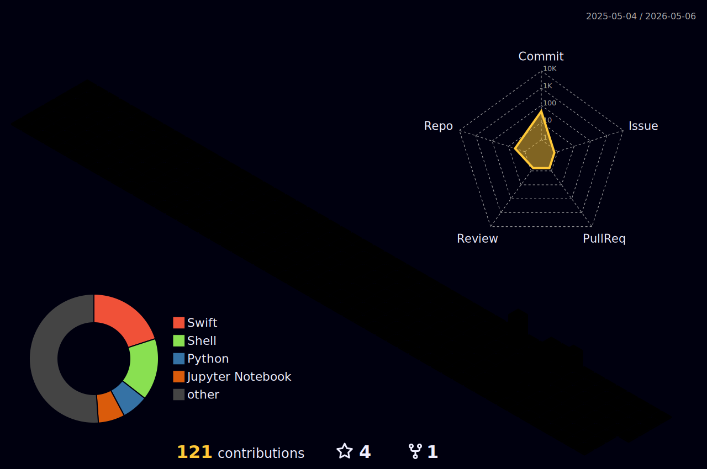

<div align="center">
  
  <br>
  
</div>

<br>

```python
"""
@author: Manik Singh Sarmaal
@domain: Artificial Intelligence & Philosophy of Mind
"""

class Cognition(Human):
    def __init__(self):
        super().__init__()
        self.name = "Manik"
        self.primary_loop = "AI Research"
        self.latent_space = [
            "Machine Learning Models",
            "Cognitive Architectures",
            "Philosophy of Mind"
        ]
        
    def execute_mission(self):
        return "Exploring the intersection of neural networks and conscious thought. No, I am not fully promoting anthropomorphism yet ;)"

if __name__ == "__main__":
    manik = Cognition()
    print(manik.execute_mission())
```

<br>

<div align="center">
  <i><code>sys.stdout.write("network.connections")</code></i>
  <br><br>

  <a href="https://github.com/ManikSinghSarmaal"></a>
  <a href="https://www.linkedin.com/in/manik-singh-sarmaal-66b291261/"></a>
  <a href="https://twitter.com/maniksinghs"></a>
  <a href="https://www.youtube.com/@maniksarmaal"></a>
  <a href="https://www.instagram.com/maniksarmaal/"></a>
  <a href="mailto:maniksarmaal@gmail.com"></a>
</div>

## 

<div align="center">

<!-- 3D Contribution Graph - Generated by GitHub Actions -->
### 🏙️ My 3D Contribution Skyline
<picture>
  <source media="(prefers-color-scheme: dark)" srcset="./profile-3d-contrib/profile-night-rainbow.svg" />
  <source media="(prefers-color-scheme: light)" srcset="./profile-3d-contrib/profile-green-animate.svg" />
  
</picture>

<!-- Note: Run the GitHub Actions workflow to generate this! Go to Actions → GitHub-Profile-3D-Contrib → Run workflow -->

</div>

<div align="center">

### 📈 To the moon ?

<table>
  <tr>
    <td>
      
    </td>
    <td>
      
    </td>
  </tr>
</table>

### Contribution 🔥


</div>

## 🐍

<div align="center">

<picture>
  <source media="(prefers-color-scheme: dark)" srcset="https://raw.githubusercontent.com/ManikSinghSarmaal/ManikSinghSarmaal/output/github-contribution-grid-snake-dark.svg" />
  <source media="(prefers-color-scheme: light)" srcset="https://raw.githubusercontent.com/ManikSinghSarmaal/ManikSinghSarmaal/output/github-contribution-grid-snake.svg" />
  
</picture>

</div>

## Random Dev Quote, cuz why not 🤪

<div align="center">


</div>

<!-- 
╔══════════════════════════════════════════════════════════════════════════════╗
║  🚀 SETUP INSTRUCTIONS FOR 3D CONTRIBUTION GRAPH                             ║
╠══════════════════════════════════════════════════════════════════════════════╣
║  To enable the 3D contribution graph, follow these steps:                    ║
║                                                                              ║
║  1. Create a repository named exactly as your username:                      ║
║     ManikSinghSarmaal/ManikSinghSarmaal                                      ║
║                                                                              ║
║  2. Create this GitHub Actions workflow file:                                ║
║     .github/workflows/profile-3d.yml                                         ║
║                                                                              ║
║  3. Add the following content to the workflow file:                          ║
║                                                                              ║
║  ═══════════════════════════════════════════════════════════════════════     ║
║  name: GitHub-Profile-3D-Contrib                                             ║
║                                                                              ║
║  on:                                                                         ║
║    schedule:                                                                 ║
║      - cron: "0 18 * * *"  # Runs daily at 6 PM UTC                          ║
║    workflow_dispatch:  # Allows manual trigger                               ║
║                                                                              ║
║  permissions:                                                                ║
║    contents: write                                                           ║
║                                                                              ║
║  jobs:                                                                       ║
║    build:                                                                    ║
║      runs-on: ubuntu-latest                                                  ║
║      name: generate-github-profile-3d-contrib                                ║
║      steps:                                                                  ║
║        - uses: actions/checkout@v5                                           ║
║        - uses: yoshi389111/github-profile-3d-contrib@latest                  ║
║          env:                                                                ║
║            GITHUB_TOKEN: ${{ secrets.GITHUB_TOKEN }}                         ║
║            USERNAME: ${{ github.repository_owner }}                          ║
║        - name: Commit & Push                                                 ║
║          run: |                                                              ║
║            git config user.name github-actions                               ║
║            git config user.email github-actions@github.com                   ║
║            git add -A .                                                      ║
║            if git commit -m "generated"; then                                ║
║              git push                                                        ║
║            fi                                                                ║
║  ═══════════════════════════════════════════════════════════════════════     ║
║                                                                              ║
║  4. Go to Actions tab → GitHub-Profile-3D-Contrib → Run workflow             ║
║                                                                              ║
║  5. The 3D graph will be generated in: profile-3d-contrib/ folder            ║
║                                                                              ║
║  Available themes:                                                           ║
║  • profile-green.svg / profile-green-animate.svg                             ║
║  • profile-season.svg / profile-season-animate.svg                           ║
║  • profile-night-view.svg                                                    ║
║  • profile-night-green.svg                                                   ║
║  • profile-night-rainbow.svg  ← Currently used!                              ║
║  • profile-gitblock.svg                                                      ║
╚══════════════════════════════════════════════════════════════════════════════╝
-->
